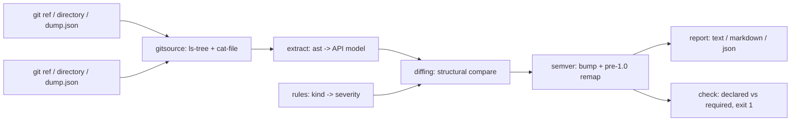

# apidrift

[English](README.md) | [中文](README.zh.md) | [日本語](README.ja.md)

[](LICENSE) [](CHANGELOG.md) [](pyproject.toml)  [](CONTRIBUTING.md)

**Python ライブラリのためのオープンソース semver 番人——2 つの git ref 間でパッケージの公開 API を diff し、正直なバージョンアップ幅を提案。あなたのコードは一切 import しない。**


```bash
git clone https://github.com/JaydenCJ/apidrift && cd apidrift && pip install -e .
```

> **プレリリース：** apidrift はまだ PyPI に公開されていません。最初のリリースまでは [JaydenCJ/apidrift](https://github.com/JaydenCJ/apidrift) をクローンし、リポジトリのルートで `pip install -e .` を実行してください。

## なぜ apidrift？

意図しない破壊的変更は毎週のように世に出ます：あるパラメータがこっそり keyword-only になり、「使われていない」ヘルパーが削除され、`1.5.0` と書かれたリリースで下流のバージョン固定が爆発する。Rust のメンテナには何年も前から cargo-semver-checks がありますが、Python 側の解は大半が 2 つのバージョンを virtualenv にインストールして import する方式——遅く、依存関係に左右され、任意の ref に対して安全でもありません。apidrift はコンパイラ流の道を選びました：両側を git のオブジェクトデータベースから直接読み出し、`ast` でパースし、得られた API モデルを構造的に diff します。checkout なし、venv なし、import なし、副作用なし——実際のパッケージの完全な diff が 1 秒未満で終わります。

|  | apidrift | griffe check | pidiff | cargo-semver-checks |
|---|---|---|---|---|
| 対象言語 | Python | Python | Python | Rust |
| パッケージを import / インストールするか | 決してしない（純粋な `ast`） | 静的解析、一部のパッケージは動的 import にフォールバック | する（両バージョンを venv に pip インストール） | 対象外（rustdoc JSON） |
| git から ref を直接読む（checkout もビルドも不要） | はい | いいえ（ロード可能なソースツリーが必要） | いいえ（インストール可能な配布物が必要） | はい |
| semver のバンプ提案（1.0 未満のダウンシフト込み） | はい | いいえ（破壊項目の列挙のみ） | 部分的（判定の報告のみ） | はい |
| *宣言された*バージョンへの CI ゲート（`check`、終了コード 1） | はい | いいえ | いいえ | はい |
| ランタイム依存 | 0 | 1 | 複数（pip・virtualenv 機構） | 対象外 |

<sub>比較は 2026-07 時点の各ツールのドキュメント上の挙動に基づく：griffe 1.x はランタイム依存を 1 つ（colorama）宣言し、静的に解決できないパッケージは動的 import することがある。pidiff は設計上ビルド済み / インストール可能な配布物を対象とする。apidrift の依存数は [pyproject.toml](pyproject.toml) の `dependencies = []` そのもの——外部ツールとして呼ぶのは手元に必ずある `git` バイナリだけ。</sub>

## 特徴

- **コードを決して実行しない**——両側とも `git cat-file` から直接取り出し、`ast` でパース。信頼できない ref にも安全で、`setup.py` の副作用とは無縁、パッケージ自身の依存関係のインストール状況にも左右されない。
- **推測ではなく本物のルール表**——約 40 種の変更種別に重大度を固定：リネーム、並び替え、keyword-only/positional-only への移動、デフォルト値の喪失、sync/async の反転、property↔method 変換、property のセッター、enum メンバー、基底クラス、`__all__` の縮小、re-export。[docs/rules.md](docs/rules.md) に文書化され、テストで強制される。
- **正直なバンプ計算**——最悪の重大度が勝つ。1.0 未満のパッケージは Cargo 流に一段下げる（breaking → minor）。`apidrift check` は `pyproject.toml` で*宣言した*幅と diff が*要求する*幅を比較し、嘘には終了コード 1 を返す。
- **3 通りの ref 表記**——git リビジョン（`v1.2.0`、`HEAD~3`、sha）、普通のディレクトリ（展開済み sdist、ワークツリー）、`apidrift dump` の JSON スナップショットを、diff の両側で自由に混在可能。
- **CI 対応の出力**——決定的な並び順、`--format text|markdown|json`、`--fail-on major|minor|patch` の終了ゲート、そしてスクリプト向けに一語だけ出力する `bump` サブコマンド。
- **Python の公開性ルールを理解**——リテラル `__all__` 契約（`+` と `+=` を含む）、アンダースコアの私有規約、dunder メソッドは API、`__init__.py` の re-export、`from x import y as y` 慣習。全部見たいときは `--include-private`。

## クイックスタート

インストール：

```bash
git clone https://github.com/JaydenCJ/apidrift && cd apidrift && pip install -e .
```

任意の Python パッケージのリポジトリで、直近のリリースタグを指すだけ（2 つ目の ref はワークツリーがデフォルト）：

```bash
apidrift diff v1.4.2
```

実際に取得した出力。[`examples/`](examples/) の `pricelib` フィクスチャから（v2 は無害な追加の下に事故的な破壊を 1 つ隠している）：

```text
apidrift: v1.4.2 -> worktree (package pricelib)

MAJOR  pricelib.money.convert: parameter rate became keyword-only; positional callers break
MAJOR  pricelib.money.format_price: public function removed
MINOR  pricelib.with_tax: public reexport added
MINOR  pricelib.cart.Cart.add: optional parameter note added (default None)
MINOR  pricelib.money.Money.rounded: optional parameter mode added (default 'half-even')
MINOR  pricelib.tax: public module added
PATCH  pricelib.money.DEFAULT_CURRENCY: value changed from 'USD' to 'EUR'

2 breaking, 4 additions, 1 compatible
suggested bump: major (1.4.2 -> 2.0.0)
```

CI でリリースにゲートを——フィクスチャの v2 は `1.5.0` しか宣言していないので `check` は失敗する：

```bash
apidrift check v1.4.2 HEAD
```

```text
apidrift check: v1.4.2 (1.4.2) -> HEAD (1.5.0), package pricelib
required bump: major, declared bump: minor
FAIL: API changes require at least a major bump (e.g. 2.0.0)
```

## コマンド

| コマンド | 動作 | 終了コード |
|---|---|---|
| `apidrift diff OLD [NEW]` | 2 つの ref 間の完全な変更レポート（`NEW` のデフォルトはワークツリー） | 0；`--fail-on` 指定時 1；用法エラー 2 |
| `apidrift bump OLD [NEW]` | 一語だけ出力：`major`・`minor`・`patch`・`none` | 0；用法エラー 2 |
| `apidrift check OLD [NEW]` | `pyproject.toml` 宣言のバージョン幅と必要な幅を比較 | 0 OK；1 幅不足；用法エラー 2 |
| `apidrift dump REF [-o FILE]` | API 表面のバージョン付き JSON スナップショットを書き出し、後で diff 可能 | 0；用法エラー 2 |

| オプション | デフォルト | 効果 |
|---|---|---|
| `--repo PATH` | `.` | git ref を解決するリポジトリ |
| `--package NAME` | 自動検出 | ツリーに複数パッケージがあるとき指定（`src/`・フラット・`lib/` レイアウトを探索） |
| `--format text\|markdown\|json` | `text` | `diff` のレポート形式 |
| `--fail-on major\|minor\|patch` | `never` | `diff` を CI ゲート化：しきい値以上で終了コード 1 |
| `--include-private` | オフ | アンダースコア始まりのモジュールと名前も追跡 |
| `--old-version` / `--new-version` | `pyproject.toml` から | `check` の宣言バージョンを上書き（`dynamic = ["version"]` のプロジェクトなど） |

## 重大度モデル

削除と呼び出し互換性の破壊は **major**、純粋な追加は **minor**、アノテーション・デフォルト値・re-export の配管変更は **patch**。約 40 種の変更種別の全表——そして意図的な制限（リテラル値のみ、継承は解決しない、トップレベル文のみ）——は [docs/rules.md](docs/rules.md) にある。1.0.0 未満では提案が一段下がり（breaking → minor）、エコシステムの慣習に一致する。

## 検証

このリポジトリは CI を一切同梱しません。上記の主張はすべてローカル実行で検証されています。このリポジトリのチェックアウトから再現できます：

```bash
pip install -e '.[dev]' && pytest && bash scripts/smoke.sh
```

出力（実際の実行からコピー、`...` で省略）：

```text
91 passed in 3.36s
...
[check] FAIL: API changes require at least a major bump (e.g. 2.0.0)
SMOKE OK
```

## アーキテクチャ



## ロードマップ

- [x] AST 抽出器、約 40 種のルール表、semver アドバイザ、git/ディレクトリ/スナップショットの 3 種 ref、`diff`/`bump`/`check`/`dump` CLI（v0.1.0）
- [ ] PyPI 公開、`pip install apidrift` 対応
- [ ] 条件付き定義：`if TYPE_CHECKING:` ブロックと `try/except ImportError` 互換シム
- [ ] `.pyi` スタブのオーバーレイで、型スタブが抽出面を精緻化
- [ ] デコレータを認識するシグネチャ（`functools.wraps` チェーン、`dataclass` 以外のクラスデコレータ）
- [ ] changelog 断片ジェネレータ：diff を Keep-a-Changelog のセクションに変換

完全なリストは [open issues](https://github.com/JaydenCJ/apidrift/issues) を参照。

## コントリビュート

コントリビュート歓迎——[good first issue](https://github.com/JaydenCJ/apidrift/issues?q=is%3Aissue+is%3Aopen+label%3A%22good+first+issue%22) から始めるか、[discussion](https://github.com/JaydenCJ/apidrift/discussions) を立ててください。開発環境の構築は [CONTRIBUTING.md](CONTRIBUTING.md) へ。

## ライセンス

[MIT](LICENSE)
