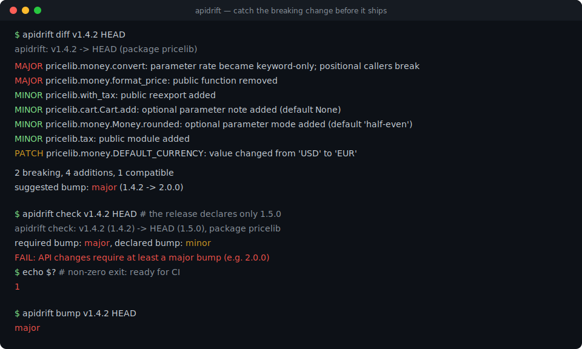
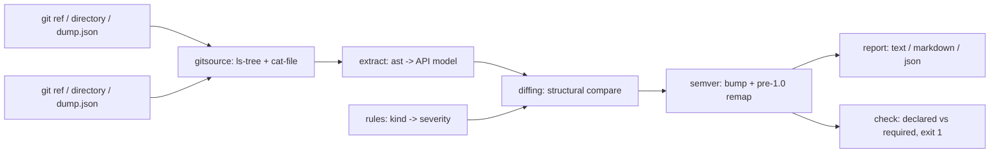

# apidrift

[English](README.md) | [中文](README.zh.md) | [日本語](README.ja.md)

[](LICENSE) [](CHANGELOG.md) [](pyproject.toml)  [](CONTRIBUTING.md)

**Open-source semver guardrail for Python libraries — diff your package's public API between git refs and get the honest version bump, without ever importing your code.**



```bash
git clone https://github.com/JaydenCJ/apidrift && cd apidrift && pip install -e .
```

> **Pre-release:** apidrift is not yet published to PyPI. Until the first release, clone [JaydenCJ/apidrift](https://github.com/JaydenCJ/apidrift) and run `pip install -e .` from the repository root.

## Why apidrift?

Accidental breaking changes ship weekly: a parameter quietly becomes keyword-only, a "dead" helper gets deleted, and downstream pins explode on a release labeled `1.5.0`. Rust maintainers have had cargo-semver-checks for years; Python's answers mostly install both versions into virtualenvs and import them — slow, dependency-sensitive, and unsafe on arbitrary refs. apidrift takes the compiler-style route instead: it reads both sides straight out of git's object database, parses them with `ast`, and diffs the resulting API models. No checkout, no venv, no import, no side effects — a full diff of a real package takes well under a second.

|  | apidrift | griffe check | pidiff | cargo-semver-checks |
|---|---|---|---|---|
| Target language | Python | Python | Python | Rust |
| Imports or installs your package | Never (pure `ast`) | Static, with dynamic-import fallback for some packages | Yes (pip-installs both versions into venvs) | n/a (rustdoc JSON) |
| Reads refs straight from git (no checkout, no build) | Yes | No (needs loadable source trees) | No (needs installable dists) | Yes |
| Suggests the semver bump (with the pre-1.0 downshift) | Yes | No (lists breakages only) | Partially (reports a verdict) | Yes |
| CI gate on the *declared* version (`check`, exit 1) | Yes | No | No | Yes |
| Runtime dependencies | 0 | 1 | several (pip, virtualenv machinery) | n/a |

<sub>Comparison reflects the tools' documented behavior as of 2026-07: griffe 1.x declares one runtime dependency (colorama) and may dynamically import packages it cannot resolve statically; pidiff works on built/installable distributions by design. apidrift's count is `dependencies = []` in [pyproject.toml](pyproject.toml) — the only external tool it shells out to is the `git` binary you already have.</sub>

## Features

- **Never runs your code** — both sides are parsed with `ast`, straight from `git cat-file`. Safe on untrusted refs, immune to `setup.py` side effects, and independent of whether the package's own dependencies are installed.
- **A real rule table, not a guess** — ~40 change kinds with pinned severities: renames, reorders, keyword-only/positional-only moves, lost defaults, sync/async flips, property↔method conversions, property setters, enum members, base classes, `__all__` shrinkage, re-exports. Documented in [docs/rules.md](docs/rules.md), enforced by tests.
- **Honest bump math** — the worst severity wins; pre-1.0 packages get the Cargo-style downshift (breaking → minor). `apidrift check` compares the bump you *declared* in `pyproject.toml` against the bump the diff *requires* and exits 1 on a lie.
- **Three ref spellings** — git revs (`v1.2.0`, `HEAD~3`, a sha), plain directories (unpacked sdists, worktrees), or JSON snapshots from `apidrift dump`, freely mixed on either side of a diff.
- **CI-ready output** — deterministic ordering, `--format text|markdown|json`, `--fail-on major|minor|patch` exit gates, and a one-word `bump` subcommand for scripting.
- **Understands Python's publicity rules** — literal `__all__` contracts (including `+` and `+=`), underscore privacy, dunder methods as API, `__init__.py` re-exports, and the `from x import y as y` convention; `--include-private` when you need everything.

## Quickstart

Install:

```bash
git clone https://github.com/JaydenCJ/apidrift && cd apidrift && pip install -e .
```

Point it at the last release tag of any Python package repository (the second ref defaults to your working tree):

```bash
apidrift diff v1.4.2
```

Real captured output, from the `pricelib` fixture in [`examples/`](examples/) (v2 hides one accidental break under harmless additions):

```text
apidrift: v1.4.2 -> worktree (package pricelib)

MAJOR  pricelib.money.convert: parameter rate became keyword-only; positional callers break
MAJOR  pricelib.money.format_price: public function removed
MINOR  pricelib.with_tax: public reexport added
MINOR  pricelib.cart.Cart.add: optional parameter note added (default None)
MINOR  pricelib.money.Money.rounded: optional parameter mode added (default 'half-even')
MINOR  pricelib.tax: public module added
PATCH  pricelib.money.DEFAULT_CURRENCY: value changed from 'USD' to 'EUR'

2 breaking, 4 additions, 1 compatible
suggested bump: major (1.4.2 -> 2.0.0)
```

Gate the release in CI — the fixture's v2 declares only `1.5.0`, so `check` fails:

```bash
apidrift check v1.4.2 HEAD
```

```text
apidrift check: v1.4.2 (1.4.2) -> HEAD (1.5.0), package pricelib
required bump: major, declared bump: minor
FAIL: API changes require at least a major bump (e.g. 2.0.0)
```

## Commands

| Command | What it does | Exit codes |
|---|---|---|
| `apidrift diff OLD [NEW]` | Full change report between two refs (`NEW` defaults to the working tree) | 0; 1 with `--fail-on`; 2 on usage errors |
| `apidrift bump OLD [NEW]` | Print exactly one word: `major`, `minor`, `patch`, or `none` | 0; 2 on usage errors |
| `apidrift check OLD [NEW]` | Compare the declared `pyproject.toml` version step against the required bump | 0 OK; 1 insufficient bump; 2 on usage errors |
| `apidrift dump REF [-o FILE]` | Write a versioned JSON snapshot of the API surface, diffable later | 0; 2 on usage errors |

| Option | Default | Effect |
|---|---|---|
| `--repo PATH` | `.` | Repository to resolve git refs in |
| `--package NAME` | auto-detected | Pick a package when the tree ships several (`src/`, flat, and `lib/` layouts are probed) |
| `--format text\|markdown\|json` | `text` | Report format for `diff` |
| `--fail-on major\|minor\|patch` | `never` | Turn `diff` into a CI gate: exit 1 at or above the threshold |
| `--include-private` | off | Also track underscore-prefixed modules and names |
| `--old-version` / `--new-version` | from `pyproject.toml` | Override the declared versions for `check` (e.g. `dynamic = ["version"]` projects) |

## Severity model

Removals and call-compatibility breaks are **major**; pure additions are **minor**; annotation, default-value, and re-export plumbing changes are **patch**. The full table of ~40 change kinds — and the deliberate limitations (literal values only, no inheritance resolution, top-level statements only) — lives in [docs/rules.md](docs/rules.md). Before 1.0.0, suggestions are downshifted one notch (breaking → minor), matching the ecosystem convention.

## Verification

This repository ships no CI; every claim above is verified by local runs. Reproduce them from a checkout of this repository:

```bash
pip install -e '.[dev]' && pytest && bash scripts/smoke.sh
```

Output (copied from a real run, truncated with `...`):

```text
91 passed in 3.36s
...
[check] FAIL: API changes require at least a major bump (e.g. 2.0.0)
SMOKE OK
```

## Architecture



## Roadmap

- [x] AST extractor, ~40-kind rule table, semver advisor, git/dir/snapshot refs, `diff`/`bump`/`check`/`dump` CLI (v0.1.0)
- [ ] PyPI release with `pip install apidrift`
- [ ] Conditional definitions: `if TYPE_CHECKING:` blocks and `try/except ImportError` shims
- [ ] `.pyi` stub overlay so typed stubs refine the extracted surface
- [ ] Decorator-aware signatures (`functools.wraps` chains, class decorators beyond `dataclass`)
- [ ] Changelog fragment generator: turn a diff into a Keep-a-Changelog section

See the [open issues](https://github.com/JaydenCJ/apidrift/issues) for the full list.

## Contributing

Contributions are welcome — start with a [good first issue](https://github.com/JaydenCJ/apidrift/issues?q=is%3Aissue+is%3Aopen+label%3A%22good+first+issue%22) or open a [discussion](https://github.com/JaydenCJ/apidrift/discussions). See [CONTRIBUTING.md](CONTRIBUTING.md) for the development setup.

## License

[MIT](LICENSE)
