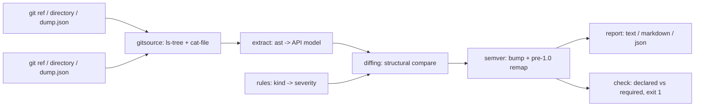

# apidrift

[English](README.md) | [中文](README.zh.md) | [日本語](README.ja.md)

[](LICENSE) [](CHANGELOG.md) [](pyproject.toml)  [](CONTRIBUTING.md)

**开源的 Python 库 semver 守门员——在两个 git ref 之间对比包的公开 API，给出诚实的版本号建议，全程不导入你的代码。**


```bash
git clone https://github.com/JaydenCJ/apidrift && cd apidrift && pip install -e .
```

> **预发布说明：** apidrift 尚未发布到 PyPI。在首个正式版之前，请克隆 [JaydenCJ/apidrift](https://github.com/JaydenCJ/apidrift)，并在仓库根目录执行 `pip install -e .`。

## 为什么选 apidrift？

意外的破坏性变更每周都在发生：某个参数悄悄变成了 keyword-only，一个"没人用"的辅助函数被删掉，下游的版本锁定在一个标着 `1.5.0` 的发布上炸开。Rust 维护者多年前就有了 cargo-semver-checks；而 Python 这边的方案大多要把两个版本装进 virtualenv 再 import——慢、受依赖影响、对任意 ref 也不安全。apidrift 走的是编译器式路线：直接从 git 对象数据库读出两侧源码，用 `ast` 解析，再对得到的 API 模型做结构化 diff。不 checkout、不建 venv、不 import、无副作用——对一个真实包做完整 diff 远不到一秒。

|  | apidrift | griffe check | pidiff | cargo-semver-checks |
|---|---|---|---|---|
| 目标语言 | Python | Python | Python | Rust |
| 是否导入 / 安装你的包 | 从不（纯 `ast`） | 静态分析，部分包会回退到动态导入 | 是（把两个版本 pip 装进 venv） | 不适用（rustdoc JSON） |
| 直接从 git 读 ref（无 checkout、无构建） | 是 | 否（需要可加载的源码树） | 否（需要可安装的发行包） | 是 |
| 给出 semver 建议（含 1.0 之前的降档规则） | 是 | 否（只列出破坏项） | 部分（给出判定结论） | 是 |
| 对*声明*版本做 CI 门禁（`check`，退出码 1） | 是 | 否 | 否 | 是 |
| 运行时依赖 | 0 | 1 | 若干（pip、virtualenv 机制） | 不适用 |

<sub>对比基于各工具截至 2026-07 的文档行为：griffe 1.x 声明一个运行时依赖（colorama），且对无法静态解析的包可能动态导入；pidiff 设计上就工作在已构建/可安装的发行包上。apidrift 的依赖数即 [pyproject.toml](pyproject.toml) 里的 `dependencies = []`——它唯一调用的外部工具是你本来就有的 `git` 二进制。</sub>

## 特性

- **从不运行你的代码**——两侧都经 `git cat-file` 直接取出、用 `ast` 解析。对不可信的 ref 安全，免疫 `setup.py` 副作用，也不要求包自身的依赖已安装。
- **真正的规则表，不靠猜**——约 40 种变更类型，严重级别全部钉死：重命名、位置调换、keyword-only/positional-only 迁移、默认值丢失、sync/async 翻转、property↔method 转换、property setter、枚举成员、基类、`__all__` 收缩、re-export。文档见 [docs/rules.md](docs/rules.md)，由测试强制执行。
- **诚实的版本号计算**——取最严重级别；1.0 之前的包按 Cargo 惯例降一档（breaking → minor）。`apidrift check` 把你在 `pyproject.toml` 里*声明*的跨度与 diff *要求*的跨度对比，说谎就退出码 1。
- **三种 ref 写法**——git 修订（`v1.2.0`、`HEAD~3`、sha）、普通目录（解包的 sdist、工作树）、或 `apidrift dump` 生成的 JSON 快照，diff 两侧可自由混用。
- **CI 友好的输出**——确定性排序、`--format text|markdown|json`、`--fail-on major|minor|patch` 退出门禁，以及只输出一个词、便于脚本化的 `bump` 子命令。
- **理解 Python 的公开性规则**——字面量 `__all__` 契约（含 `+` 与 `+=`）、下划线私有约定、dunder 方法算 API、`__init__.py` re-export，以及 `from x import y as y` 惯例；需要全量时用 `--include-private`。

## 快速上手

安装：

```bash
git clone https://github.com/JaydenCJ/apidrift && cd apidrift && pip install -e .
```

指向任意 Python 包仓库的上一个发布 tag（第二个 ref 默认是你的工作树）：

```bash
apidrift diff v1.4.2
```

真实抓取的输出，来自 [`examples/`](examples/) 里的 `pricelib` 夹具（v2 把一处意外破坏藏在无害的新增之下）：

```text
apidrift: v1.4.2 -> worktree (package pricelib)

MAJOR  pricelib.money.convert: parameter rate became keyword-only; positional callers break
MAJOR  pricelib.money.format_price: public function removed
MINOR  pricelib.with_tax: public reexport added
MINOR  pricelib.cart.Cart.add: optional parameter note added (default None)
MINOR  pricelib.money.Money.rounded: optional parameter mode added (default 'half-even')
MINOR  pricelib.tax: public module added
PATCH  pricelib.money.DEFAULT_CURRENCY: value changed from 'USD' to 'EUR'

2 breaking, 4 additions, 1 compatible
suggested bump: major (1.4.2 -> 2.0.0)
```

在 CI 里给发布上门禁——夹具的 v2 只声明了 `1.5.0`，所以 `check` 失败：

```bash
apidrift check v1.4.2 HEAD
```

```text
apidrift check: v1.4.2 (1.4.2) -> HEAD (1.5.0), package pricelib
required bump: major, declared bump: minor
FAIL: API changes require at least a major bump (e.g. 2.0.0)
```

## 命令

| 命令 | 作用 | 退出码 |
|---|---|---|
| `apidrift diff OLD [NEW]` | 两个 ref 之间的完整变更报告（`NEW` 默认为工作树） | 0；带 `--fail-on` 时 1；用法错误 2 |
| `apidrift bump OLD [NEW]` | 只打印一个词：`major`、`minor`、`patch` 或 `none` | 0；用法错误 2 |
| `apidrift check OLD [NEW]` | 把 `pyproject.toml` 声明的版本跨度与所需跨度对比 | 0 通过；1 跨度不足；用法错误 2 |
| `apidrift dump REF [-o FILE]` | 写出带版本号的 API 表面 JSON 快照，之后可参与 diff | 0；用法错误 2 |

| 选项 | 默认值 | 效果 |
|---|---|---|
| `--repo PATH` | `.` | 在哪个仓库里解析 git ref |
| `--package NAME` | 自动探测 | 当树里有多个包时指定一个（探测 `src/`、扁平和 `lib/` 布局） |
| `--format text\|markdown\|json` | `text` | `diff` 的报告格式 |
| `--fail-on major\|minor\|patch` | `never` | 把 `diff` 变成 CI 门禁：达到或超过阈值即退出码 1 |
| `--include-private` | 关闭 | 同时跟踪下划线开头的模块和名字 |
| `--old-version` / `--new-version` | 读自 `pyproject.toml` | 为 `check` 覆盖声明版本（如 `dynamic = ["version"]` 的项目） |

## 严重级别模型

删除与调用兼容性破坏是 **major**；纯新增是 **minor**；注解、默认值和 re-export 管路变更是 **patch**。约 40 种变更类型的完整表格——以及刻意的限制（只看字面量、不解析继承、只看顶层语句）——都在 [docs/rules.md](docs/rules.md)。1.0.0 之前的建议会降一档（breaking → minor），与生态惯例一致。

## 验证

本仓库不携带任何 CI；上面的每一条声明都由本地运行验证。从本仓库的检出即可复现：

```bash
pip install -e '.[dev]' && pytest && bash scripts/smoke.sh
```

输出（拷贝自真实运行，用 `...` 截断）：

```text
91 passed in 3.36s
...
[check] FAIL: API changes require at least a major bump (e.g. 2.0.0)
SMOKE OK
```

## 架构



## 路线图

- [x] AST 提取器、约 40 种规则表、semver 顾问、git/目录/快照三种 ref、`diff`/`bump`/`check`/`dump` CLI（v0.1.0）
- [ ] 发布到 PyPI，支持 `pip install apidrift`
- [ ] 条件定义：`if TYPE_CHECKING:` 块与 `try/except ImportError` 兼容垫片
- [ ] `.pyi` 存根叠加，让类型存根细化提取到的 API 表面
- [ ] 感知装饰器的签名（`functools.wraps` 链、`dataclass` 之外的类装饰器）
- [ ] changelog 片段生成器：把一次 diff 变成一段 Keep-a-Changelog 条目

完整列表见 [open issues](https://github.com/JaydenCJ/apidrift/issues)。

## 参与贡献

欢迎贡献——可以从 [good first issue](https://github.com/JaydenCJ/apidrift/issues?q=is%3Aissue+is%3Aopen+label%3A%22good+first+issue%22) 开始，或发起一个 [discussion](https://github.com/JaydenCJ/apidrift/discussions)。开发环境搭建见 [CONTRIBUTING.md](CONTRIBUTING.md)。

## 许可证

[MIT](LICENSE)
